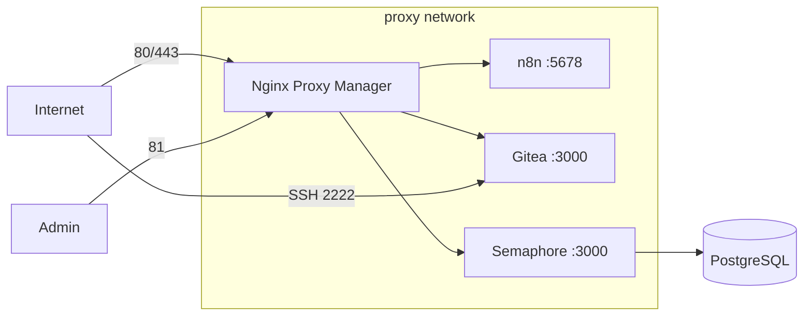

# LabMaster — Docker-Host Bootstrap

Automated, reproducible provisioning of a **Docker host on Ubuntu Server LTS**.
After a fresh OS install, a **single command** turns the machine into a
production-ready Docker host running Nginx Proxy Manager, n8n, Semaphore and
Gitea — with persistent data, randomly generated secrets and a backup/restore
workflow.

```bash
git clone <your-repo-url> labmaster
cd labmaster
sudo ./install.sh        # or: sudo bash install.sh
```

On first run the installer prompts interactively for `DOMAIN`, `TIMEZONE`,
subdomains and ports (defaults from `.env.example`). For unattended installs,
set `ASSUME_DEFAULTS=1` to accept all defaults without prompting.

## What you get

| Service | Purpose | Access |
|---------|---------|--------|
| **Nginx Proxy Manager** | Reverse proxy + Let's Encrypt UI (SQLite) | Ports 80 / 81 / 443 |
| **n8n** | Workflow automation | `https://n8n.<domain>` (via proxy) |
| **Semaphore** | Ansible/Terraform UI (+ PostgreSQL) | `https://automation.<domain>` |
| **Gitea** | Self-hosted Git (SQLite) | `https://git.<domain>`, SSH on `:2222` |

All containers join the shared external `proxy` network and use the
`unless-stopped` restart policy.

## Architecture



## Repository layout

```
LabMaster/
├── install.sh          # one-command bootstrap (idempotent)
├── update.sh           # pull images + recreate stacks
├── backup.sh           # archive data, compose, secrets (+ DB dump)
├── restore.sh          # restore from an archive
├── teardown.sh         # clean reset of the environment (test helper)
├── .env.example        # central configuration template
├── lib/common.sh       # shared bash helpers
├── compose/<service>/  # one docker-compose.yml per service
├── scripts/firewall.sh # optional UFW rules
└── docs/               # INSTALL / BACKUP / RESTORE / UPDATE / TROUBLESHOOTING
```

At runtime everything lives under **`/opt/docker`** (`DOCKER_ROOT`):
config (`.env`), generated secrets (`.secrets.env`, `chmod 600`), compose
stacks, persistent `data/` and `backups/`.

## Configuration

Edit `.env` (created from `.env.example` on first run). Key values:

```ini
DOMAIN=example.com
TIMEZONE=Europe/Berlin
N8N_SUBDOMAIN=n8n
GITEA_SUBDOMAIN=git
SEMAPHORE_SUBDOMAIN=automation
GITEA_SSH_PORT=2222
STACKS="nginx-proxy-manager gitea n8n semaphore"
```

**Secrets are never hardcoded.** On first install, `install.sh` generates them
into `/opt/docker/.secrets.env`. Both `.env` and `.secrets.env` are git-ignored.

## Documentation

- [docs/INSTALL.md](docs/INSTALL.md) — installation walkthrough
- [docs/UPDATE.md](docs/UPDATE.md) — updating the host
- [docs/BACKUP.md](docs/BACKUP.md) — backup concept
- [docs/RESTORE.md](docs/RESTORE.md) — disaster recovery
- [docs/TROUBLESHOOTING.md](docs/TROUBLESHOOTING.md) — common issues

## Adding more services

The stack is built for growth (Home Assistant, Grafana, Prometheus,
Uptime Kuma, Vaultwarden, …):

1. Create `compose/<service>/docker-compose.yml` — join the `proxy` network,
   store data under `${DOCKER_ROOT}/data/<service>`, read any secrets from
   `.secrets.env`.
2. Add `<service>` to the `STACKS` variable in `.env`.
3. Run `sudo ./update.sh` (or `./install.sh`).

See [docs/TROUBLESHOOTING.md](docs/TROUBLESHOOTING.md#adding-a-new-stack).

## Production hardening (recommendations)

- Enable the firewall: `sudo /opt/docker/scripts/firewall.sh` then `ufw enable`.
- Enable unattended OS security updates (`unattended-upgrades`).
- Ship backups off-site (rsync/restic/S3) — `/opt/docker/backups` is local only.
- Add a monitoring stack (Prometheus + Grafana + Uptime Kuma).
- Consider a Docker socket proxy and rootless Docker.
- Change the NPM default admin login immediately after first start.
- Restrict the NPM admin port (81) to a VPN/LAN, not the public internet.
