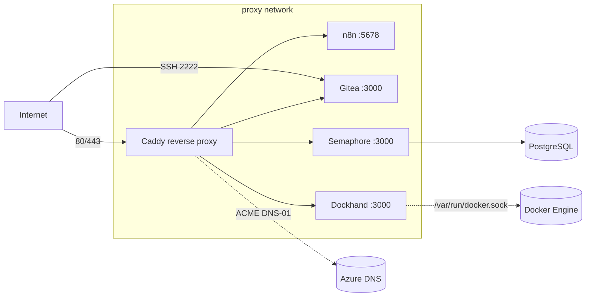

# LabMaster — Docker-Host Bootstrap

Automated, reproducible provisioning of a **Docker host on Ubuntu Server LTS**.
After a fresh OS install, a **single command** turns the machine into a
production-ready Docker host running a Caddy reverse proxy, n8n, Semaphore,
Gitea and Dockhand — with persistent data, randomly generated secrets,
automatic TLS and a backup/restore workflow.

```bash
sudo apt update && sudo apt install -y git   # if git is not installed yet
git clone <your-repo-url> labmaster
cd labmaster
sudo ./install.sh        # or: sudo bash install.sh
```

On first run the installer prompts interactively for `DOMAIN`, `TIMEZONE`,
subdomains and ports (defaults from `.env.example`). For unattended installs,
set `ASSUME_DEFAULTS=1` to accept all defaults without prompting.

### Reverse proxy: Caddy with automatic TLS

Caddy is the single entrypoint on ports 80/443. It terminates TLS automatically
and its routes are **generated from `STACKS`** — there is no admin UI to click.
The config (`/opt/docker/data/caddy/Caddyfile`) is (re)written by `install.sh`
and `update.sh`; to regenerate and hot-reload it after changes run:

```bash
sudo /opt/docker/scripts/setup-caddy.sh
```

TLS is configured in `.env`:

- **`CADDY_TLS_MODE=letsencrypt`** (default) — real certificates via ACME. The
  default DNS provider is **Azure** (`CADDY_DNS_PROVIDER=azure`), which uses the
  **DNS-01 challenge**: no inbound ports or public reachability required, and it
  can issue wildcard certificates. The Caddy image is built locally with the
  [`caddy-dns/azure`](https://github.com/caddy-dns/azure) plugin. Put the Azure
  service-principal credentials (`AZURE_*`) in `/opt/docker/.secrets.env`, or
  leave `tenant/client/secret` empty to use a Managed Identity. Switch providers
  by setting `CADDY_DNS_PROVIDER` + `CADDY_DNS_MODULE` together.
- **`CADDY_TLS_MODE=internal`** — self-signed certificates via Caddy's internal
  CA (offline/homelab). Browsers warn until you trust Caddy's root CA. This is
  also used as an automatic fallback if ACME-DNS credentials are missing, so the
  proxy always starts.

## What you get

| Service | Purpose | Access |
|---------|---------|--------|
| **Caddy** | Reverse proxy, automatic TLS via ACME (Azure DNS-01 by default) | Ports 80 / 443 |
| **n8n** | Workflow automation | `https://n8n.<domain>` (via proxy) |
| **Semaphore** | Ansible/Terraform UI (+ PostgreSQL) | `https://automation.<domain>` |
| **Gitea** | Self-hosted Git (SQLite) | `https://git.<domain>`, SSH on `:2222` |
| **Dockhand** | Docker management UI (mounts Docker socket) | `https://dockhand.<domain>` (via proxy) |

All containers join the shared external `proxy` network and use the
`unless-stopped` restart policy.

## Architecture



## Repository layout

```
LabMaster/
├── install.sh          # one-command bootstrap (idempotent)
├── update.sh           # pull images + recreate stacks
├── backup.sh           # archive data, compose, secrets (+ DB dump)
├── restore.sh          # restore from an archive
├── teardown.sh         # clean reset of the environment (test helper)
├── .env.example        # central configuration template
├── lib/common.sh       # shared bash helpers
├── compose/<service>/  # one docker-compose.yml per service
├── scripts/firewall.sh # optional UFW rules
└── docs/               # INSTALL / BACKUP / RESTORE / UPDATE / TROUBLESHOOTING
```

At runtime everything lives under **`/opt/docker`** (`DOCKER_ROOT`):
config (`.env`), generated secrets (`.secrets.env`, `chmod 600`), compose
stacks, persistent `data/` and `backups/`.

## Configuration

Edit `.env` (created from `.env.example` on first run). Key values:

```ini
DOMAIN=example.com
TIMEZONE=Europe/Berlin
N8N_SUBDOMAIN=n8n
GITEA_SUBDOMAIN=git
SEMAPHORE_SUBDOMAIN=automation
GITEA_SSH_PORT=2222
CADDY_TLS_MODE=letsencrypt
CADDY_DNS_PROVIDER=azure
STACKS="caddy gitea n8n semaphore dockhand"
```

**Secrets are never hardcoded.** On first install, `install.sh` generates them
into `/opt/docker/.secrets.env`. Both `.env` and `.secrets.env` are git-ignored.

**Semaphore PowerShell image.** Semaphore runs tasks inside its own container,
so PowerShell support comes from the image tag. There is no rolling
`latest-powershell` tag, so by default (`SEMAPHORE_IMAGE_AUTO=1`) `install.sh`
and `update.sh` auto-resolve the newest **stable** `*-powershell` tag and write
it to `SEMAPHORE_IMAGE_TAG` in `.env`. To pin a specific version (or a
non-PowerShell image), set `SEMAPHORE_IMAGE_AUTO=0` and `SEMAPHORE_IMAGE_TAG`
manually.

## Documentation

- [docs/INSTALL.md](docs/INSTALL.md) — installation walkthrough
- [docs/UPDATE.md](docs/UPDATE.md) — updating the host
- [docs/BACKUP.md](docs/BACKUP.md) — backup concept
- [docs/RESTORE.md](docs/RESTORE.md) — disaster recovery
- [docs/TROUBLESHOOTING.md](docs/TROUBLESHOOTING.md) — common issues

## Adding more services

The stack is built for growth (Home Assistant, Grafana, Prometheus,
Uptime Kuma, Vaultwarden, …):

1. Create `compose/<service>/docker-compose.yml` — join the `proxy` network,
   store data under `${DOCKER_ROOT}/data/<service>`, read any secrets from
   `.secrets.env`.
2. Add `<service>` to the `STACKS` variable in `.env`.
3. Run `sudo ./update.sh` (or `./install.sh`).

See [docs/TROUBLESHOOTING.md](docs/TROUBLESHOOTING.md#adding-a-new-stack).

## Production hardening (recommendations)

- Enable the firewall: `sudo /opt/docker/scripts/firewall.sh` then `ufw enable`.
- Enable unattended OS security updates (`unattended-upgrades`).
- Ship backups off-site (rsync/restic/S3) — `/opt/docker/backups` is local only.
- Add a monitoring stack (Prometheus + Grafana + Uptime Kuma).
- Consider a Docker socket proxy and rootless Docker. **Dockhand mounts
  `/var/run/docker.sock`, which grants it root-equivalent control of the host** —
  keep it behind the proxy (never expose port 3000 publicly), restrict who can
  reach it, and front it with a docker-socket-proxy for read-only/limited access.
- Protect the Azure credentials in `.secrets.env` and scope the service
  principal to the minimum (DNS Zone Contributor on the relevant zone only).
- For a quick offline/homelab start, `CADDY_TLS_MODE=internal` issues self-signed
  certificates with no external dependencies (trust Caddy's root CA to silence
  browser warnings).
